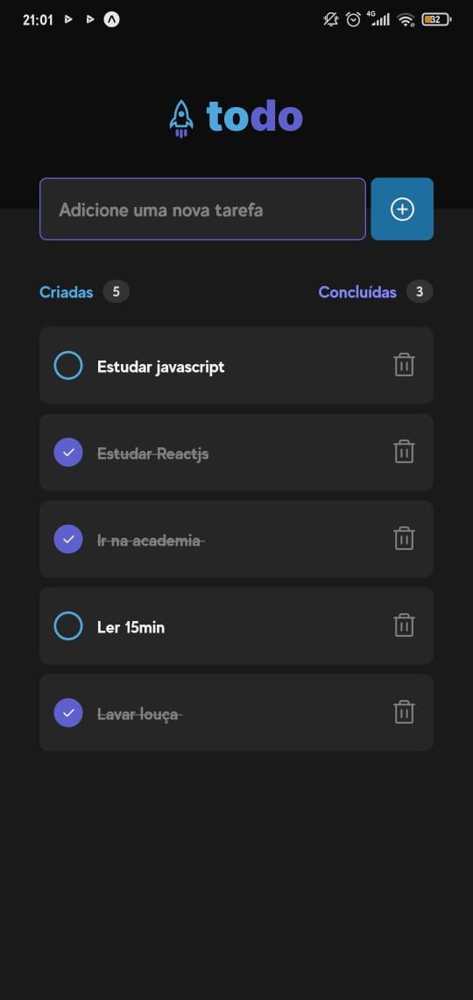
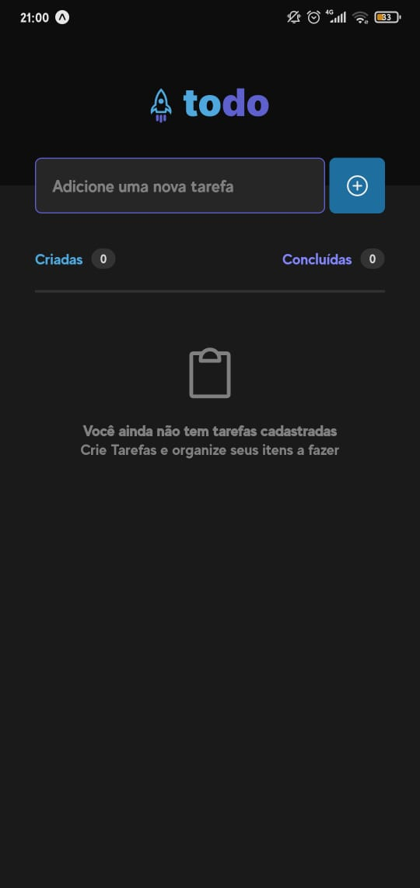

# To do List React Native

## To do list Mobile App

## Desafio desenvolvido durante o curso Ignite de React Native - Rocketseat

## Projeto






# Install

Clone this repository and install it dependencies with this command:
```sh
$ npm install
```
Run the application with expo start command, it will start the app:
```sh
$ expo start
```